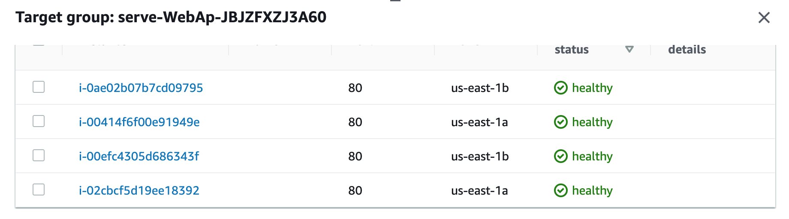

# Web App URL to test
# [Web App URL](http://serve-webap-1kyxdtd7fpm73-361444225.us-east-1.elb.amazonaws.com/)

# Deploy a High-Availability Web App using CloudFormation

This project contains a cloudformation script that is used to provision infrastructure on AWS

### Project Architecture

Server and Network stack successfully provisioned

Instance Dashboard

Running instances

Autoscaling Group

Healthy Target Group
